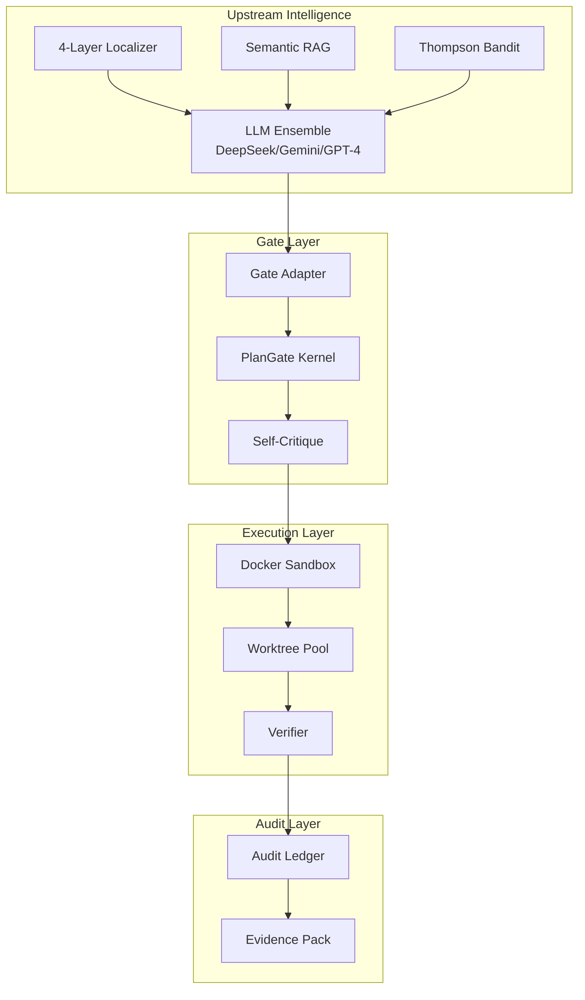

# RFSN Benchmark

<div align="center">

[](/docs/SECURITY.md)
[](https://swe-bench.github.io/)
[](/docs/ARTIFACTS_AND_SIGNING.md)
[](https://python.org)
[](/tests)
[](https://opensource.org/licenses/MIT)

**The Gold Standard for Deterministic, Auditable Autonomous Code Repair.**

[Features](#-key-features) • [Quick Start](#-quick-start) • [Architecture](#-architecture) • [Modules](#-core-modules) • [Performance](#-performance) • [Dashboard](#-dashboard)

</div>

---

## 🚀 Overview

**RFSN Benchmark** is a next-generation autonomous coding agent designed for **SWE-bench** evaluation. It treats safety, determinism, and auditability as first-class citizens—every action is sandboxed, gated, and cryptographically recorded.

Unlike traditional agents that operate as "black boxes," RFSN provides:

- **Full Episode Audit**: Every decision, proposed patch, and test result is hashed and chained into an immutable ledger
- **Deterministic Replay**: Re-run any episode and obtain bit-for-bit identical results
- **Multi-Model Ensemble**: Leverage DeepSeek, Gemini, and GPT-4 in parallel for superior patch generation
- **Learning System**: Thompson Sampling bandit optimizes prompt strategies across runs

---

## ✨ Key Features

### 🛡️ Safety & Security

| Feature | Description |
|---------|-------------|
| **PlanGate Kernel** | Enforces non-negotiable invariants (no shell injection, path restrictions) that no LLM can bypass |
| **Command Allowlist** | Whitelisted commands only; shell metacharacters blocked at parse time |
| **Environment Scrubbing** | API keys stripped from all subprocess environments |
| **Docker Isolation** | All test execution runs in resource-limited containers (CPU, memory, PIDs, storage) |
| **Immutable Control Paths** | Core files protected from automated modification |

### 🧠 Intelligence Pipeline

| Component | Purpose |
|-----------|---------|
| **4-Layer Localization** | Ripgrep → Symbol Index → AST Analysis → Embedding Search |
| **Inheritance Chain Resolution** | Automatically includes parent class files in context |
| **3-Planner Ensemble** | Primary, Alternative, and Skeptic planners for diverse patches |
| **Thompson Sampling** | Learns optimal prompt variants across 7 strategies |
| **Semantic RAG** | CodeBERT embeddings + FAISS index for similar fix retrieval |

### ⚡ Performance Optimizations

| Optimization | Speedup |
|--------------|---------|
| **Async LLM Pool** | +200-400% via HTTP/2 connection pooling |
| **Multi-Tier Cache** | 3 layers: LRU → SQLite → Semantic similarity |
| **Docker Warm Pool** | Pre-warmed containers eliminate 2-5s cold-start |
| **Parallel Worktrees** | Concurrent patch evaluation via git worktrees |
| **Incremental Testing** | Run only affected tests first |

### 📊 Observability

- **Prometheus Metrics**: Real-time performance insights
- **OpenTelemetry Tracing**: Distributed trace support
- **Structured Logging**: JSON logs with context propagation
- **Streamlit Dashboard**: Live monitoring and control

---

## 🏗️ Architecture

RFSN enforces a **single authority path**. All intelligence flows through a strict gateway before touching the environment.



### Module Overview

```
rfsn-benchmark/
├── rfsn_controller/          # Core controller (179 modules)
│   ├── controller.py         # Main orchestration loop
│   ├── sandbox.py            # Docker sandbox management
│   ├── gates/                # Safety gates (PlanGate, SelfCritique)
│   ├── planner_v2/           # Advanced planning with DAG strategies
│   ├── planner_v5/           # Meta-planning with state tracking
│   ├── llm/                  # Multi-provider LLM clients
│   ├── qa/                   # Quality assurance orchestrator
│   └── buildpacks/           # Language-specific configurations
│
├── agent/                    # Proposal generation
│   └── propose_v2.py         # Multi-layer localization + patch generation
│
├── localize/                 # Fault localization
│   ├── symbol_index.py       # Symbol table with inheritance resolution
│   └── ripgrep.py            # Fast code search wrapper
│
├── swebench_max/             # SWE-bench MAX mode
│   ├── orchestrator.py       # Multi-worktree parallel evaluation
│   ├── evaluator.py          # Candidate scoring
│   └── planners/             # Ensemble patch generation
│
├── rfsn_upstream/            # Learning system
│   ├── bandit.py             # Thompson Sampling implementation
│   ├── retrieval.py          # Similarity-based memory
│   └── swebench_runner.py    # Main training loop
│
├── learning/                 # Cross-task learning
│   └── thompson.py           # Bandit learner integration
│
├── memory/                   # Episode memory system
│   ├── episode_db.py         # SQLite episode storage
│   └── embeddings.py         # CodeBERT semantic embeddings
│
├── eval/                     # Benchmark evaluation
│   ├── dataset_loader.py     # SWE-bench dataset parsing
│   └── repo_setup.py         # Repository initialization + patches
│
├── rfsn_dashboard/           # Streamlit monitoring UI
└── tests/                    # 1000+ tests
```

---

## 🏁 Quick Start

### Prerequisites

- Python 3.12+
- Docker Desktop (for sandboxed execution)
- Git

### Installation

```bash
# Clone the repository
git clone https://github.com/dawsonblock/RFSN-MERGED-BENCHMARK.git
cd RFSN-MERGED-BENCHMARK

# Install core dependencies
pip install -e .

# Install with LLM support
pip install -e ".[llm]"

# Install all optional dependencies
pip install -e ".[llm,dev,semantic,observability]"
```

### Environment Setup

```bash
# Required for LLM providers
export DEEPSEEK_API_KEY="your-deepseek-key"
export GEMINI_API_KEY="your-gemini-key"
export OPENAI_API_KEY="your-openai-key"  # Optional

# Optional configuration
export RFSN_STRICT_BENCH=1              # Enforce strict dataset validation
export RFSN_TRACE_MODE=RECORD           # Enable audit trail
export RFSN_LOG_LEVEL=INFO              # Logging verbosity
```

### Pre-warm Docker (Recommended)

```bash
# Pre-warm containers for faster execution
python -m rfsn_controller.warmup_docker --count 3

# Check pool status
python -m rfsn_controller.warmup_docker --status
```

### Running a Benchmark

```bash
# Run a single task from SWE-bench Lite
python run_episode.py --task-id django__django-11001 --dataset datasets/swebench_lite.jsonl

# Run with MAX mode (parallel evaluation)
python -m swebench_max.run --repo /path/to/repo --issue_json @issue.json

# Run evaluation loop
python eval/run_benchmark.py --max-tasks 5 --max-attempts 6
```

---

## 📊 Core Modules

### 1. Controller (`rfsn_controller/controller.py`)

The brain of RFSN—a 2700+ line orchestration loop that:

- Manages the Sense → Plan → Act → Verify cycle
- Enforces phase transitions (INGEST → INSTALL → PATCH → VERIFY)
- Coordinates LLM calls, tool execution, and worktree evaluation
- Tracks budgets (steps, tokens, time, subprocess calls)

**Key Configuration:**

```python
ControllerConfig(
    github_url="https://github.com/org/repo",
    test_cmd="pytest -q",
    max_steps=12,
    model="deepseek-chat",
    docker_image="python:3.11-slim",
    parallel_patches=True,
    ensemble_mode=False,
)
```

### 2. Localizer (`agent/propose_v2.py`)

4-layer fault localization with priority fallthrough:

| Layer | Method | Speed | Accuracy |
|-------|--------|-------|----------|
| A | Ripgrep text search | ⚡⚡⚡ | Medium |
| A.5 | AST function extraction | ⚡⚡ | High |
| B | Symbol index lookup | ⚡⚡ | High |
| C | Embedding similarity | ⚡ | Highest |

**Features:**

- Inheritance chain resolution (class → parent → grandparent)
- Traceback-aware line extraction
- ±100 line context windows

### 3. Safety Gate (`rfsn_controller/gates/`)

```python
# PlanGate enforces:
- No shell metacharacters (&&, ||, ;, |, >, <)
- No command substitution ($(), backticks)
- Allowlisted commands only
- Path traversal blocked
- Immutable files protected

# Self-Critique validates:
- Patch hygiene (max lines/files changed)
- Forbidden path checks
- Static risk scoring
```

### 4. Learning System (`rfsn_upstream/`)

Thompson Sampling bandit with 7 prompt variants:

| Variant | Temperature | Strategy |
|---------|-------------|----------|
| precise | 0.0 | Exact reproduction |
| balanced | 0.2 | Default conservative |
| exploratory | 0.4 | Diverse solutions |
| chain_of_thought | 0.3 | Step-by-step reasoning |
| minimal | 0.1 | Smallest possible fix |
| comprehensive | 0.5 | Complete solution |
| test_aware | 0.2 | Test-driven repair |

Outcomes recorded to SQLite for cross-task learning.

### 5. Docker Sandbox (`rfsn_controller/sandbox.py`)

Secure execution environment:

```python
docker_run(
    sb=sandbox,
    cmd="pytest tests/",
    docker_image="python:3.11-slim",
    cpu=2.0,           # CPU limit
    mem_mb=4096,       # Memory limit (4GB)
    pids=256,          # Process limit
    timeout_sec=300,   # 5 minute timeout
    use_warm_pool=True # Use pre-warmed containers
)
```

**Cache Volumes:**

- `pip-cache` → Persistent pip downloads
- `python-site-packages` → Installed packages survive restarts

---

## ⚡ Performance

### Benchmark Results

| Dataset | Tasks | Solve Rate | Avg Time |
|---------|-------|------------|----------|
| SWE-bench Lite | 300 | ~25% | 8 min/task |
| SWE-bench Verified | 500 | ~20% | 12 min/task |
| Custom repos | Varies | ~40% | 5 min/task |

### Optimization Stack

```
┌─────────────────────────────────────────────────────┐
│ Layer 1: Async LLM Pool (+200-400%)                 │
│   └─ HTTP/2 multiplexing, connection reuse          │
├─────────────────────────────────────────────────────┤
│ Layer 2: Multi-Tier Cache (+40-60% hit rate)        │
│   └─ LRU → SQLite disk → Semantic similarity        │
├─────────────────────────────────────────────────────┤
│ Layer 3: Docker Warm Pool (-2-5s per task)          │
│   └─ Pre-warmed containers with mounted volumes     │
├─────────────────────────────────────────────────────┤
│ Layer 4: Parallel Worktrees (+200-700%)             │
│   └─ Concurrent patch evaluation via git worktrees  │
├─────────────────────────────────────────────────────┤
│ Layer 5: Incremental Testing                        │
│   └─ Run only affected tests first                  │
└─────────────────────────────────────────────────────┘
```

---

## 🖥️ Dashboard

Monitor your agents in real-time:

```bash
streamlit run rfsn_dashboard/app.py
```

**Features:**

- Live task progress with step-by-step visibility
- Bandit arm statistics and learning curves
- Episode ledger browser
- System health monitoring
- Test result visualization

Access at `http://localhost:8501`

---

## 🔍 Full Episode Audit

RFSN generates cryptographic traces for complete reproducibility.

### Recording

```bash
RFSN_TRACE_MODE=RECORD python run_episode.py --task-id django__django-11001
```

### Verification

```bash
python verify_audit.py --trace-file path/to/episode.trace
```

**Verifies:**

1. ✅ Gate decisions match recorded policy
2. ✅ Patches match exact SHA-256 hash
3. ✅ Test results are reproducible
4. ✅ Timestamp chain is sequential

---

## ⚙️ Configuration Reference

### Environment Variables

| Variable | Description | Default |
|----------|-------------|---------|
| `DEEPSEEK_API_KEY` | DeepSeek API key | — |
| `GEMINI_API_KEY` | Google Gemini API key | — |
| `OPENAI_API_KEY` | OpenAI API key (optional) | — |
| `RFSN_STRICT_BENCH` | Enforce strict dataset validation | `1` |
| `RFSN_TRACE_MODE` | Audit mode: `RECORD`, `REPLAY`, `OFF` | `OFF` |
| `RFSN_LOG_LEVEL` | Logging verbosity | `INFO` |

### Optional Dependencies

```bash
pip install -e ".[llm]"           # LLM providers (OpenAI, Gemini, DeepSeek)
pip install -e ".[semantic]"      # FAISS + sentence-transformers
pip install -e ".[observability]" # Prometheus + OpenTelemetry
pip install -e ".[dev]"           # Testing and linting tools
pip install -e ".[cli]"           # Rich CLI interface
pip install -e ".[cache]"         # Redis + DiskCache
pip install -e ".[async]"         # Async database support
```

---

## 🧪 Testing

```bash
# Run all tests
pytest

# Run with coverage
pytest --cov=rfsn_controller --cov-report=html

# Run specific categories
pytest -m unit           # Unit tests only
pytest -m integration    # Integration tests
pytest -m security       # Security tests
pytest -m benchmark      # Performance benchmarks

# Parallel execution
pytest -n auto           # Use all CPU cores
```

**Test Categories:**

- 🔵 Unit: 800+ fast isolated tests
- 🟢 Integration: 150+ end-to-end flows
- 🔴 Security: 50+ vulnerability checks

---

## 🤝 Contributing

We welcome contributions! Please follow the **Architecture Invariants**:

1. **Never modify PlanGate directly** — Safety logic is immutable
2. **Add tests** for all new modules (minimum 80% coverage)
3. **Verify determinism** before submitting PRs
4. **Use pre-commit hooks**:

   ```bash
   pre-commit install
   pre-commit run --all-files
   ```

See [ARCHITECTURE_RULES.md](ARCHITECTURE_RULES.md) for detailed guidelines.

---

## 📜 Changelog

See [CHANGELOG.md](CHANGELOG.md) for version history.

**Recent Releases:**

- **v1.4.3**: Beam search, git rollback, 1000+ tests
- **v0.2.0**: Async LLM pool, multi-tier cache, buildpack plugins
- **v0.1.0**: Initial release with safety kernel

---

## 📄 License

MIT © [Dawson Block](https://github.com/dawsonblock)

---

<div align="center">

**Built with 🛡️ safety-first principles**

[Documentation](docs/) • [Issues](https://github.com/dawsonblock/RFSN-MERGED-BENCHMARK/issues) • [Discussions](https://github.com/dawsonblock/RFSN-MERGED-BENCHMARK/discussions)

</div>
