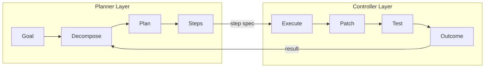
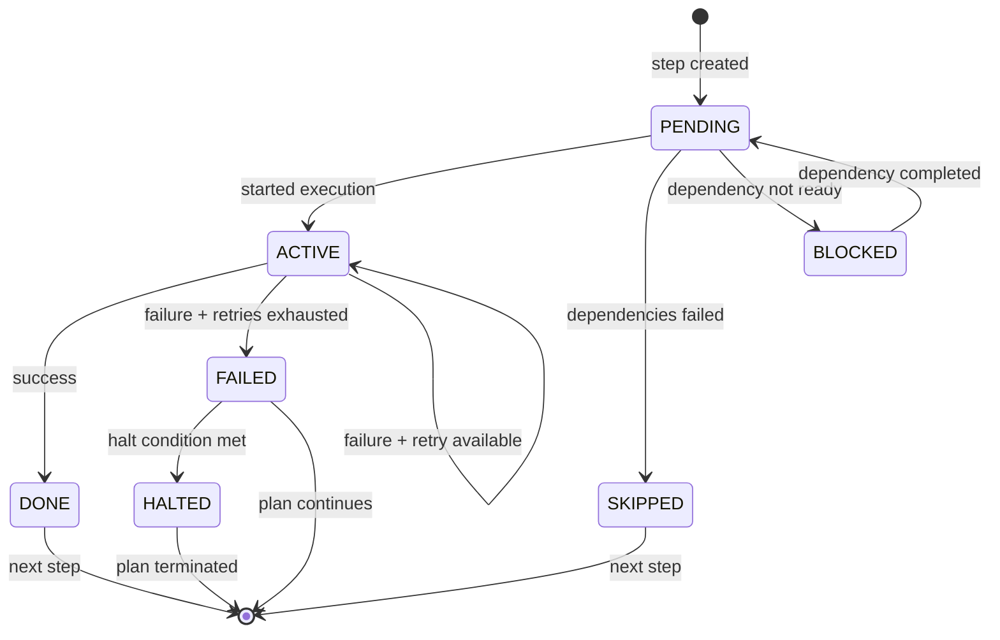
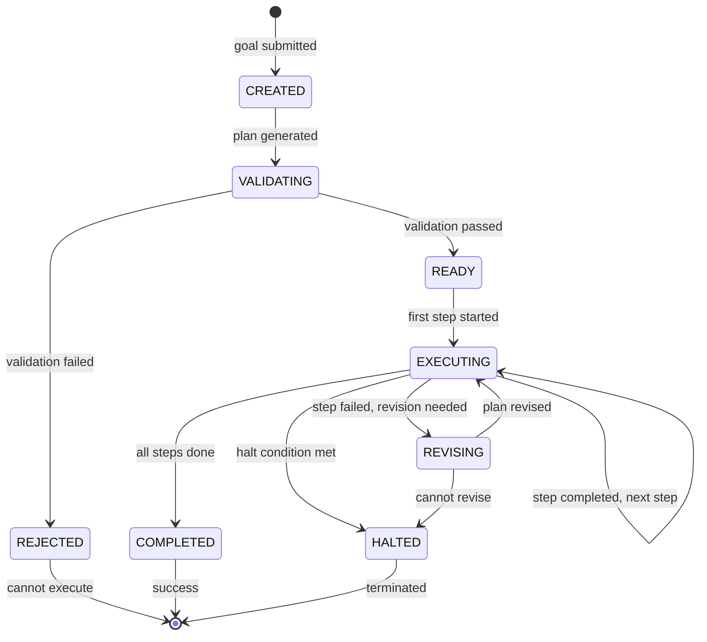
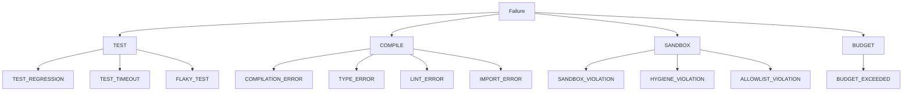
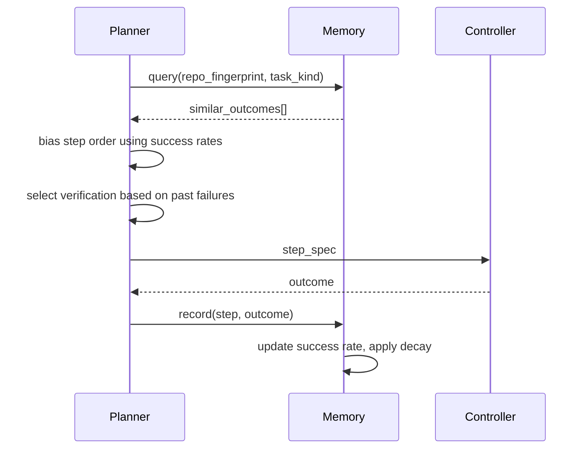
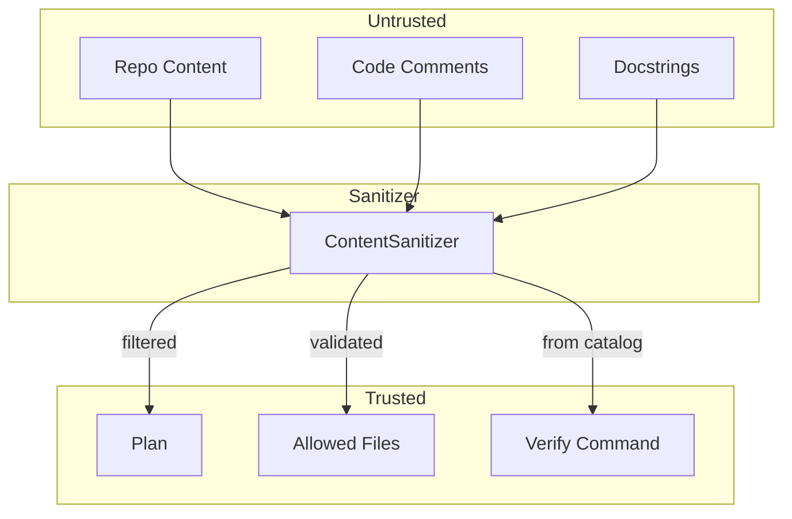

# RFSN Planner v2 Architecture

> **The planner outputs plans only. The controller remains the sole executor.**

## Core Separation



**The planner NEVER:**

- Executes code
- Writes files
- Applies patches
- Runs tests
- Bypasses allowlists or budgets

---

## Step Lifecycle State Machine



### Valid Transitions

| From | To | Trigger |
|------|-----|---------|
| PENDING | ACTIVE | `start_step()` called |
| PENDING | SKIPPED | Dependency failed |
| PENDING | BLOCKED | Dependency not complete |
| BLOCKED | PENDING | Dependency completed |
| ACTIVE | DONE | Controller returns success |
| ACTIVE | ACTIVE | Controller fails, retries remain |
| ACTIVE | FAILED | Controller fails, no retries |
| FAILED | HALTED | Halt condition triggered |

---

## Plan Lifecycle State Machine



---

## Controller Interface Contract

### Planner → Controller (Step Spec)

```json
{
  "step_id": "fix-test-001",
  "title": "Fix failing assertion",
  "intent": "Update expected value in test",
  "allowed_files": ["tests/test_auth.py"],
  "verify": "pytest tests/test_auth.py -v",
  "risk_level": "LOW",
  "controller_task_spec": {
    "type": "PATCH",
    "target_file": "tests/test_auth.py",
    "hint": "Update expected value from 200 to 201"
  }
}
```

### Controller → Planner (Outcome)

```json
{
  "step_id": "fix-test-001",
  "success": false,
  "tests_passed": false,
  "touched_files": ["tests/test_auth.py"],
  "diff_hash": "abc123",
  "metrics": {
    "tokens_used": 1200,
    "duration_ms": 8500,
    "patch_cycles": 2
  },
  "failure_evidence": {
    "category": "TEST_REGRESSION",
    "top_failing_tests": ["test_auth.py::test_login"],
    "stack_trace_head": "AssertionError: Expected 201, got 500",
    "suggestion": "Check the login route handler"
  }
}
```

---

## Failure Taxonomy



### Revision Strategy by Failure Type

| Category | Planner Action |
|----------|----------------|
| `TEST_REGRESSION` | Add context, reduce scope, isolate |
| `COMPILATION_ERROR` | Add syntax check step, narrow files |
| `TYPE_ERROR` | Add type check before retry |
| `LINT_ERROR` | Add auto-fix step |
| `IMPORT_ERROR` | Add dependency resolution step |
| `SANDBOX_VIOLATION` | HALT immediately |
| `HYGIENE_VIOLATION` | HALT immediately |
| `ALLOWLIST_VIOLATION` | HALT immediately |
| `BUDGET_EXCEEDED` | HALT immediately |
| `FLAKY_TEST` | Retry with isolation |
| `UNKNOWN` | Reduce scope, retry once |

---

## Halt Conditions

The planner HALTS (stops all execution) when:

1. **Consecutive failures** ≥ 3
2. **Identical failure** on same step ≥ 2 times
3. **Security violation** (sandbox, hygiene, allowlist)
4. **Budget exhausted** (tokens, cycles, time)
5. **File growth** > threshold (new file explosion)
6. **Flaky streak** ≥ 3 (pass/fail/pass/fail)

---

## Memory Integration



### Similarity Computation

1. **Repo Fingerprint**: Hash of setup.py/package.json + test command
2. **Task Kind**: Normalized goal category (fix_test, add_feature, refactor)
3. **Match Score**: Jaccard similarity of n-grams

### Decay Function

```python
weight = base_weight * (0.95 ** days_since_outcome)
```

Past outcomes decay to prevent overfitting to old patterns.

---

## Tool Contract Registry

Tools are selected from a fixed catalog - never invented.

### Categories

| Category | Description |
|----------|-------------|
| `TEST` | Run tests (pytest, jest, go test) |
| `LINT` | Static analysis (ruff, eslint, clippy) |
| `TYPE_CHECK` | Type validation (mypy, tsc, pyright) |
| `BUILD` | Compile/build (cmake, cargo build) |
| `VALIDATE` | Syntax check (py_compile) |

### Standard Recipes

| Recipe | Tools |
|--------|-------|
| `python-quick` | py_compile → ruff |
| `python-full` | py_compile → ruff → mypy → pytest |
| `node-full` | eslint → tsc → npm test |
| `go-full` | go vet → go test |
| `rust-full` | clippy → cargo test |

---

## File Structure

```
planner_v2/
├── schema.py           # Plan, Step, PlanState dataclasses
├── plan.schema.json    # Formal JSON Schema
├── planner.py          # PlannerV2 class
├── lifecycle.py        # State machine
├── controller_adapter.py   # Single interface point
├── memory_adapter.py   # Outcome memory integration
├── tool_registry.py    # Tool contract catalog
├── governance/
│   ├── validator.py    # Plan validation
│   ├── budget.py       # Resource caps
│   ├── halt_conditions.py  # Halt logic
│   ├── sanitizer.py    # Prompt injection defense
│   └── risk_routing.py # Risk-based constraints
├── llm_decomposer.py   # LLM goal decomposition
├── revision_strategies.py  # Failure-specific revision
├── parallel_executor.py    # Concurrent steps
├── plan_cache.py       # Goal caching
├── metrics.py          # Prometheus metrics
├── artifact_log.py     # Audit trail
├── replay.py           # Deterministic replay
└── verification_hooks.py   # Verify recipes
```

---

## Security Model



**Rules:**

- Repo content is hostile input
- Planner ignores embedded instructions
- Commands come only from Tool Registry
- Allowlists are explicit, never inferred
